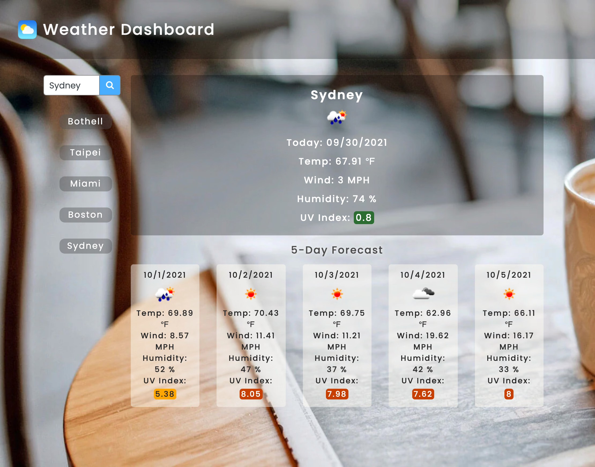
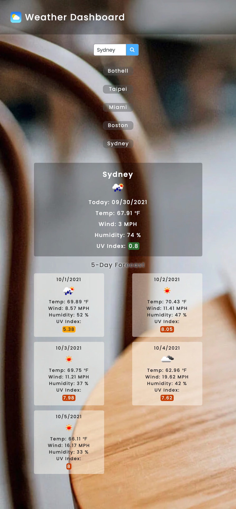

# 06 Server-Side APIs: Weather Dashboard

It's a weather application for searching global cities' weather condition, temp., humidity, wind speed and UV index.

## User Story

```
AS A traveler
I WANT to see the weather outlook for multiple cities
SO THAT I can plan a trip accordingly
```

## Acceptance Criteria

```
GIVEN a weather dashboard with form inputs
WHEN I search for a city
THEN I am presented with current and future conditions for that city and that city is added to the search history
WHEN I view current weather conditions for that city
THEN I am presented with the city name, the date, an icon representation of weather conditions, the temperature, the humidity, the wind speed, and the UV index
WHEN I view the UV index
THEN I am presented with a color that indicates whether the conditions are favorable, moderate, or severe
WHEN I view future weather conditions for that city
THEN I am presented with a 5-day forecast that displays the date, an icon representation of weather conditions, the temperature, the wind speed, and the humidity
WHEN I click on a city in the search history
THEN I am again presented with current and future conditions for that city
```
## Technology used
Request OpenWeather API to fetch weather data, using moment.js for today's date and toLocaleDateString() method to get the date for 5 day forecast.

## License
[](https://www.gnu.org/licenses/MIT%20License)

## Others

_Screenshot Landscape Mode_
<br><br/>
_Screenshot Portrait Mode_


[Weather Dashboard Website](https://mt0814.github.io/Week6-Weather-dashboard/)

---

© 2021 Trilogy Education Services, LLC, a 2U, Inc. brand. Confidential and Proprietary. All Rights Reserved.
